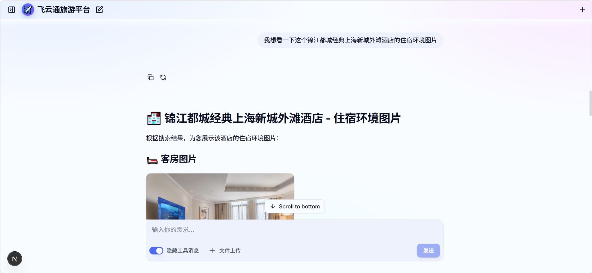

# 飞云通旅游平台-





飞云通旅游平台
一个基于 LangGraph + MCP + Agent Skill 的「智能旅游助手」
面向短途差旅场景，覆盖 **机票查询 / 酒店推荐 / 天气查询 / 行程规划 / 预订** 全流程


## 一、项目背景

### 1.1 痛点

短途差旅（1~3 天的商务出行、周末游）是高频但低效的场景：

- **信息分散**：查机票在航司官网、查酒店在 OTA、查天气还要再开一个 App；
- **决策成本高**：面对海量航班、酒店，用户不知道"哪个最便宜、哪个最快、哪个性价比最高"；
- **行程整合难**：查完机票查酒店，最后还得自己拼一份行程单，缺少一个"一站式"助手。

### 1.2 我们的方案

**飞云通旅游平台** —— 一个能"听懂需求 → 查真实数据 → 比选推荐 → 一键预订 → 生成行程单"的智能旅游助手。

用户只需要用一句话（例如"我下周五去上海出差，帮我订便宜点的机票和市中心评分高的酒店，顺便看下那几天天气"），Agent 就能自动完成整个流程。

---

## 二、技术架构

### 2.1 技术栈总览

| 层次     | 技术选型                                  | 说明                                   |
| -------- | ----------------------------------------- | -------------------------------------- |
| 前端     | Next.js 14 + React 18 + Tailwind          | 聊天式交互界面（`pnpm dev` 启动）      |
| 后端     | Python + LangGraph + LangChain            | 主 Agent 编排（`langgraph dev` 启动）  |
| 多智能体 | deepagents `create_deep_agent` + SubAgent | 主代理调度多个子代理                   |
| 实时数据 | MCP（Model Context Protocol）             | 接入途牛（航班/酒店）、wttr.in（天气） |
| 知识规范 | Agent Skill（SKILL.md）                   | 把"查询规范/推荐逻辑"沉淀为可复用技能  |
| 文件存储 | MinIO                                     | 行程单等文件持久化（优雅降级）         |

### 2.2 架构分层

```
┌─────────────────────────────────────────────────────────┐
│                    前端 Next.js（飞云通旅游平台）           │
│              聊天 UI · 快捷指令 · 流式输出                  │
└──────────────────────┬──────────────────────────────────┘
                       │ WebSocket / 流式
┌──────────────────────▼──────────────────────────────────┐
│              主 Agent（all_agent）                        │
│   需求澄清 → 路由调度 → 结果汇总                          │
└───────┬──────────────────────────┬──────────────────────┘
        │                          │
┌───────▼──────────┐     ┌─────────▼────────────┐
│  travel-agent     │     │  itinerary-agent     │
│  单点查询          │     │  完整行程规划          │
│  机票/酒店/天气    │     │  交通+住宿+行程单      │
└───────┬──────────┘     └─────────┬────────────┘
        │                          │
        │        工具层（MCP + Skill）              │
        │  ┌──────────────┬──────────────┐          │
        │  │ travel_mcp    │  weather_mcp  │          │
        │  │ (途牛/兜底Mock)│  (wttr.in)    │          │
        │  └──────────────┴──────────────┘          │
        │        技能层（SKILL.md）                    │
        │  flight/hotel/weather/travel/itinerary     │
```

### 2.3 核心设计：主代理 + 子代理分工

| 角色                | 职责                                       | 何时调度           |
| ------------------- | ------------------------------------------ | ------------------ |
| **主 Agent**        | 需求澄清、意图识别、路由、结果汇总         | 始终在线           |
| **travel-agent**    | 单点查询（只查机票 / 只查酒店 / 只查天气） | "帮我查下航班"     |
| **itinerary-agent** | 完整行程规划（机票+酒店+天气+行程单）      | "帮我规划一次行程" |

> 主代理的提示词里固化了 6 步流程：**需求澄清 → 单点查询 → 完整规划 → 方案比选 → 预订 → 行程单**，并且强约束"不要自己查数据，必须交给子代理"。

---

## 三、核心机制详解

### 3.1 MCP —— 实时数据的接入标准

MCP（Model Context Protocol）让 Agent 能像"插 USB 设备"一样接入外部数据源。

- **途牛 MCP**：通过 `npx tuniu-cli`（stdio 模式）拉起，提供真实航班票价、酒店价格与**酒店图片**；
- **wttr.in**：免费天气接口，返回 JSON（中文），无需 Key；
- **兜底策略**：未配置 API Key 或连接失败时，**自动降级为内置 Mock 数据**，保证项目"到手即可跑通"。

### 3.2 Agent Skill —— 把经验沉淀为规范

每个技能是一份 `SKILL.md`，定义了"查什么、先确认什么、怎么推荐、哪些是红线"：

| 技能                  | 作用                                                       |
| --------------------- | ---------------------------------------------------------- |
| `travel`              | 实时数据查询总规范（途牛工具清单、图片展示、API Key 配置） |
| `flight_search`       | 航班查询规范（必填字段、直飞/中转、比价）                  |
| `hotel_search`        | 酒店推荐规范（偏好收集、评分×价格×位置排序）               |
| `weather_search`      | 天气查询规范（穿衣/带伞建议）                              |
| `itinerary_generator` | 行程单生成规范（Markdown 模板 + 规则）                     |

> 技能被 `LazyFilesystemBackend` 复制到每个会话的工作目录，子代理运行时动态加载，实现"规范与代码解耦"。

### 3.3 双通道数据策略（真实优先 + Mock 兜底）

```python
# content/mcps/travel_mcp.py 核心逻辑
def get_tools():
    if os.getenv("TUNIU_API_KEY"):          # 有 Key → 连真实途牛 MCP
        try:
            return _real_tools()             # 实时报价 + 酒店图片
        except Exception:
            print("连接失败，降级 Mock")
    return _mock_tools()                     # 无 Key → Mock 演示数据
```

**好处**：开发/演示阶段零成本跑通全流程；接入真实 Key 后无缝切换到实时数据。

---

## 四、项目流程（用户视角）

### 4.1 完整交互流程

```
用户输入："下周五去上海出差，订便宜机票 + 市中心高评分酒店，看天气"
        │
        ▼
① 需求澄清（主 Agent）
   识别：目的地上海、出差（商务）、需机票+酒店+天气
   补问：日期、人数、预算
        │
        ▼
② 路由调度（主 Agent）
   完整行程 → 交给 itinerary-agent
        │
        ▼
③ 数据查询（子代理调用工具）
   search_flights  → 航班列表（直飞/中转，价格）
   search_hotels   → 酒店列表（评分、价格、图片 URL）
   search_weather  → 目的地天气（温度、穿衣建议）
        │
        ▼
④ 方案比选（子代理）
   机票：标出「最便宜 / 最快 / 性价比」
   酒店：按「评分 × 价格 × 位置」给首选 + 备选
   （酒店图片直接以 Markdown 图片展示）
        │
        ▼
⑤ 预订（用户确认后）
   book_flight / book_hotel → 生成订单号（演示）
        │
        ▼
⑥ 行程单生成（itinerary-agent）
   输出结构化 Markdown：概览 / 交通 / 住宿 / 每日安排 / 预算 / 出行提示
```

### 4.2 关键能力对照

| 需求              | 实现方式                                                    |
| ----------------- | ----------------------------------------------------------- |
| 实时航班/票价     | 途牛 `flight_search`（兜底 Mock）                           |
| 实时酒店列表/价格 | 途牛 `hotel_search`（兜底 Mock）                            |
| **酒店图片**      | 途牛 `hotel_search` 返回图片 URL，`hotel_detail` 返回房型图 |
| 天气查询          | `weather_mcp` 调 wttr.in（中文 JSON）                       |
| 行程单生成        | `itinerary-agent` + `itinerary_generator` 技能              |
| 预订              | `book_flight` / `book_hotel`（演示用 Mock）                 |

---

## 五、接入真实数据的配置

### 5.1 获取途牛 API Key

1. 打开途牛开放平台：**https://open.tuniu.com/mcp**
2. 注册登录 → 控制台 → 申请 API Key
3. 在项目 `.env` 中填写：

```bash
TUNIU_API_KEY=你的APIKey
TUNIU_AUTH_TYPE=apiKey
```

### 5.2 酒店图片返回机制

- `hotel_search` 返回酒店列表时，**直接包含酒店图片 URL**；
- `hotel_detail` 返回某家酒店的**房型报价 + 房型图片**；
- Agent 拿到 URL 后，用 Markdown 图片语法 `` 直接渲染给用户。

> 全程无需额外图片接口，图片随酒店数据一起返回。

---

## 六、项目启动（演示）

> 环境要求：Podman（Hyper-V 环境），**不使用** Docker/WSL。

```bash
# 1. 启动后端 Agent
langgraph dev

# 2. 启动前端（另开终端）
cd sub_projects/agent-chat-ui
pnpm install
pnpm dev
```

访问前端地址，即可与"飞云通旅游平台"对话。

### 演示话术建议

| 场景             | 演示输入                                       |
| ---------------- | ---------------------------------------------- |
| 查机票           | "帮我查 9 月 10 号北京飞上海的机票"            |
| 查酒店（带图片） | "上海 9 月 10 号住一晚，市中心 400-600 的酒店" |
| 查天气           | "上海下周天气怎么样"                           |
| 完整行程         | "我下周五去上海出差 3 天，帮我规划行程"        |
| 预订             | "就订 MU5102 这张，姓名张三"                   |

---

## 七、项目亮点总结

1. **多智能体协同**：主代理 + 双子代理（travel / itinerary），职责清晰、按需调度。
2. **MCP 标准化接入**：途牛（航班/酒店/图片）+ wttr.in（天气），统一走 MCP 协议。
3. **Agent Skill 知识沉淀**：查询规范、推荐逻辑、红线约束全部写成可复用 `SKILL.md`。
4. **真实优先 + Mock 兜底**：有 Key 用实时数据，无 Key 也能完整演示全流程。
5. **图片能力**：酒店图片随数据返回，无需额外图片接口。
6. **端到端可运行**：前后端、技能、子代理、工具均已打通并验证。

---


